| Nama      | Shobahus Solichin |
| ----------- | ----------- |
| NIM     | 312010076       |
| Kelas   | TI.20.A.1        |

## Langkah langkah praktikum 7

## 1. Install XAMPP
Unduh XAMPP dari https://www.apachefriends.org/download.html

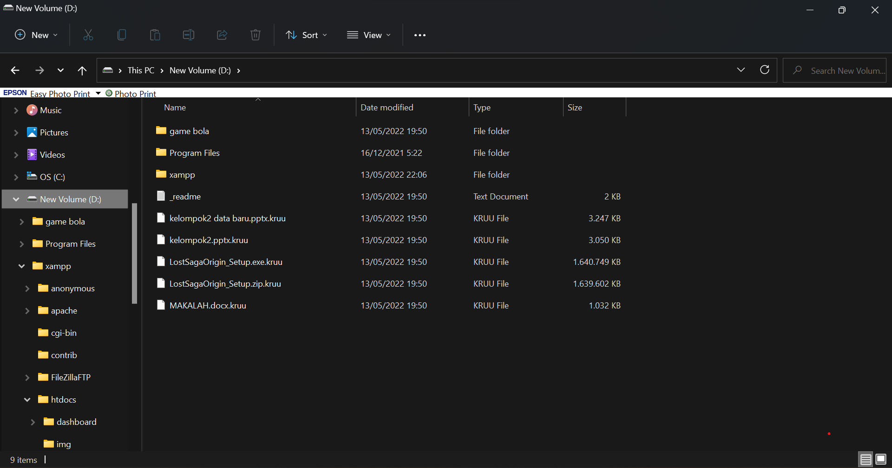

## 2. Menjalankan web server
Untuk menjalankan web server dari menu XAMPP Control

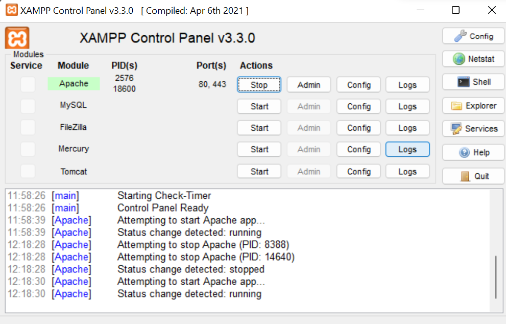

• Uji coba apakah server sudah berkerja dengan baik
http://127.0.0.1 atau http://localhost

Tampil halaman utama XAMPP jika server sudah berkerja dengan baik.

• Dokumen Website
Semua file website tempatkan di direktori: \xampp\htdocs\

• Database MySQL
Direktori: \xampp\mysql\

Manajemen database: http://localhost/phpmyadmin

## 3. Memulai PHP
Buat folder lab7_php_dasar pada root directory web server (\xampp\htdocs)

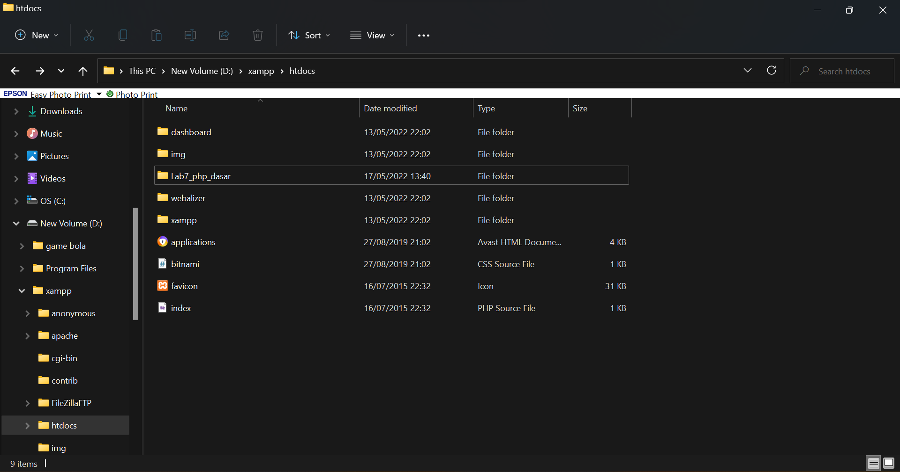

Kemudian untuk mengakses direktory tersebut pada web server dengan mengakses URL:
http://localhost/Lab7_php_dasar/

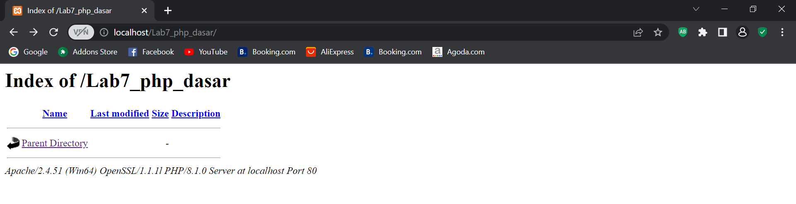

## 4. PHP Dasar
Buat file baru dengan nama php_dasar.php pada directory tersebut. Kemudian buat
kode seperti berikut.

## **Codingan** ##

```PHP
<!DOCTYPE html>
<html lang="en">
<head>
<meta charset="UTF-8">
<title>PHP Dasar</title>
</head>
<body>
<h1>Belajar PHP Dasar</h1>
<?php
echo "Hello World";
?>
</body>
</html>
```
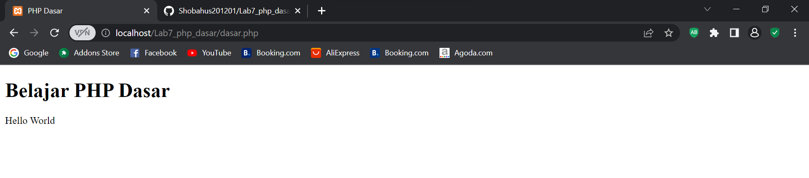
Kemudian untuk mengakses hasilnya melalui URL:
http://localhost/lab7_php_dasar/php_dasar.php

### Variable PHP
Menambahkan variable pada program.

## **Codingan** ##

```PHP
<?php
$nim = "312010076";
$nama = 'Shobahus Solichin';
echo "NIM : " . $nim . "<br>";
echo "Nama : $nama";
?>
```

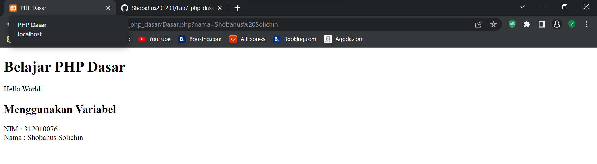

### Predefine Variable `$_GET`
## **Codingan** ##

```PHP
<?php
echo 'Selamat Datang ' . $_GET['nama'];
?>
```

Untuk mengaksesnya gunakan URL:
http://localhost/Lab7_php_dasar/dasar.php?nama=%20Shoba

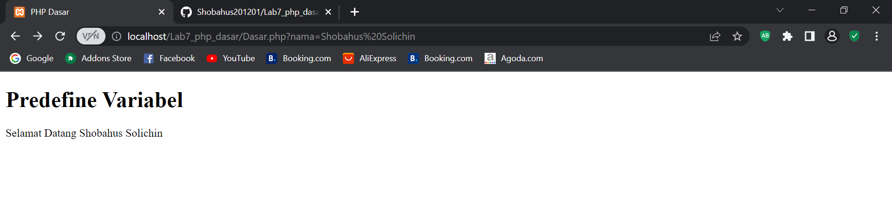

## 5. Membuat Form Input
## **Codingannya** ##
```PHP
<!DOCTYPE html>
<html lang="en">
<head>
<meta charset="UTF-8">
<title>PHP Dasar</title>
</head>
<body>
<h2>Form Input</h2>
<form method="post">
<label>Nama: </label>
<input type="text" name="nama">
<input type="submit" value="Kirim">
</form>
<?php
echo 'Selamat Datang ' . $_POST['nama'];
?>
</body>
</html>
```
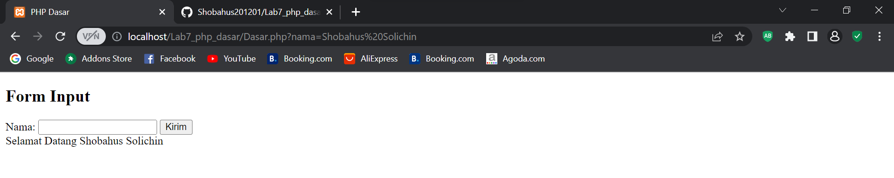

### Operator
## **Codingannya** ##
```PHP
<?php
$gaji = 1000000;
$pajak = 0.1;
$thp = $gaji - ($gaji*$pajak);
echo "Gaji sebelum pajak = Rp. $gaji <br>";
echo "Gaji yang dibawa pulang = Rp. $thp";
?>
```
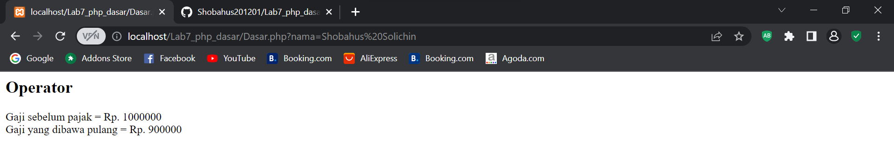

### Kondisi IF
## **Codingannya** ##
```PHP
<?php
$nama_hari = date("l");
if ($nama_hari == "Sunday") {
echo "Minggu";
} elseif ($nama_hari == "Monday") {
echo "Senin";
} else {
echo "Selasa";
}
?>
```
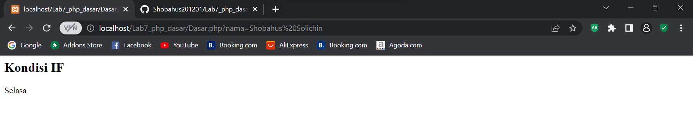

### Kondisi Switch
## **Codingannya** ##
```PHP
<h2>Kondisi Switch</h2>
<?php
    $nama_hari = date("l");
    switch ($nama_hari) {
        case "Sunday":
            echo "Minggu";
            break;
        case "Monday":
            echo "Senin";
            break;
        case "Tuesday":
            echo "Selasa";
            break;
        default:
            echo "Sabtu";
    }
    echo"/$nama_hari";
?>
```

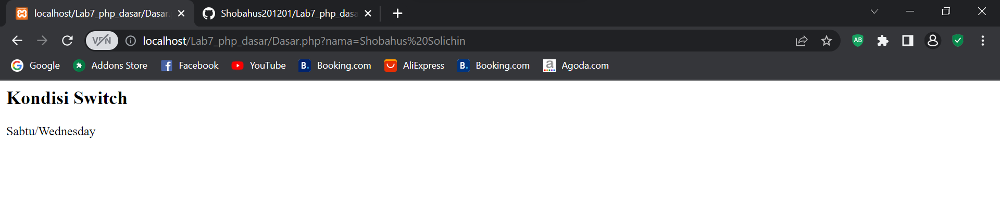

### Perulangan for
## **Codingannya** ##
```PHP
<?php
echo "Perulangan 1 sampai 10 <br />";
for ($i=1; $i<=10; $i++) {
echo "Perulangan ke: " . $i . '<br />';
}
echo "Perulangan Menurun dari 10 ke 1 <br />";
for ($i=10; $i>=1; $i--) {
echo "Perulangan ke: " . $i . '<br />';
}
?>
```

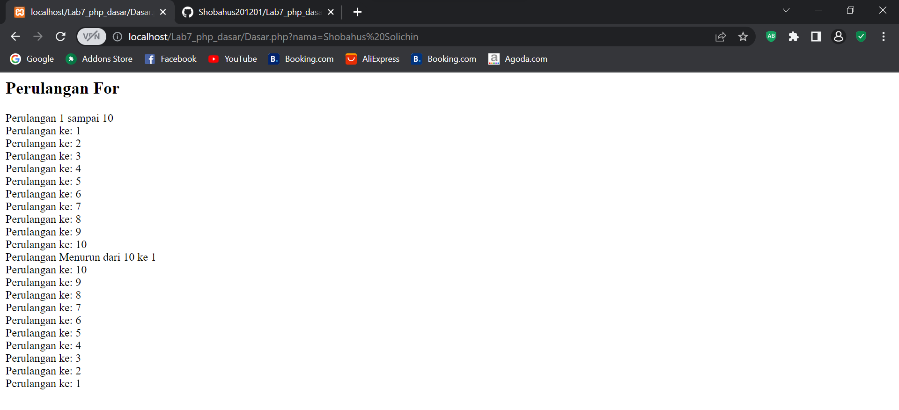

### Perulangan while
## **Codingannya** ##
```PHP
<?php
echo "Perulangan 1 sampai 10 <br />";
$i=1;
while ($i<=10) {
echo "Perulangan ke: " . $i . '<br />';
$i++;
}
?>
```
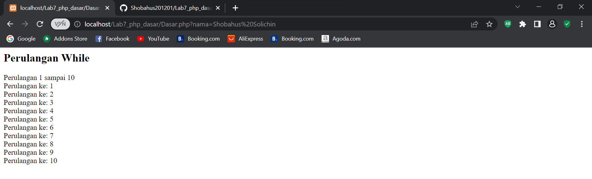

### Perulangan dowwhile
## **Codingannya** ##
```PHP
<?php
echo "Perulangan 1 sampai 10 <br />";
$i=1;
do {
echo "Perulangan ke: " . $i . '<br />';
$i++;
} while ($i<=10);
?>
```

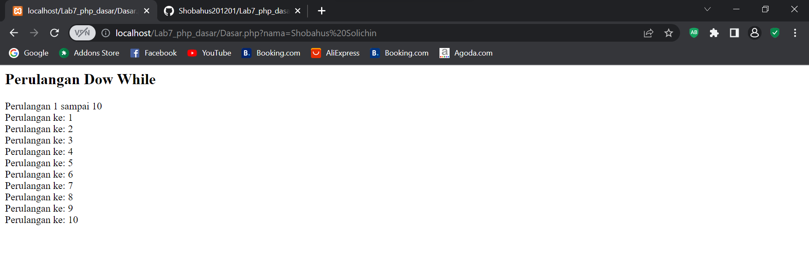

## Pertanyaan dan Tugas
Buatlah program PHP sederhana dengan menggunakan form input yang menampilkan
nama, tanggal lahir dan pekerjaan. Kemudian tampilkan outputnya dengan menghitung
umur berdasarkan inputan tanggal lahir. Dan pilihan pekerjaan dengan gaji yang
berbeda-beda sesuai pilihan pekerjaan.

## Jawab
```PHP
<!DOCTYPE html>
<html lang="en">
<head>
    <meta charset="UTF-8">
    <meta http-equiv="X-UA-Compatible" content="IE=edge">
    <meta name="viewport" content="width=device-width, initial-scale=1.0">
    <title>Tugas</title>
</head>
<body>
   <h2>TUGAS</h2>
    <form class="form" method="post" >
            <label>Nama: </label>
            <br>
            <input type="text" name="nama">
            <br>
            <label>Tanggal Lahir: </label>
            <br>
            <input type="text" name="tgl_lahir">
            <br>
            <label>Pekerjaan: </label>
            <br>
            <select name='pekerjaan'>
                <option value="-">Pilih Pekerjaan</option>
                <option value='Graphic Designer'>Graphic Designer</option>
                <option value='Web Developer'>Web Developer</option>
                <option value='HRD'>HRD</option>
                <option value='System Analyst'>System Analyst</option>
                <option value="IT Support">IT Support</option>
            </select>
            <br>
            <br>
            <button type="kirim">Submit</button>
    </form>
    <h2>HASIL</h2>

    <?php
        # Memanggil Nama
        echo 'Nama: ' . $_POST['nama'];

        # Merubah Tanggal Lahir menjadi Umur (Tahun)
        $tgl_lahir = @$_POST['tgl_lahir'];

        $lahir = new DateTime($tgl_lahir);
        $hari_ini = new DateTime();

        $diff = $hari_ini->diff($lahir);

        # Memanggil fungsi umur yg sudah dibuat diatas
        echo "<br> Umur: ". $diff->y ." Tahun";

        # Memanggil pekerjaan
        echo "<br> Pekerjaan: ". $_POST['pekerjaan'];

        # Kondisi if pekerjaan untuk menentukan gaji
        $pekerjaan = @$_POST['pekerjaan'];

        if($pekerjaan == "Graphic Designer"){
            echo '<br> Gaji: Rp. 4.000.000,-';
        }elseif($pekerjaan == "Web Developer"){
            echo '<br> Gaji: Rp. 5.000.000,-';
        }elseif($pekerjaan == "HRD"){
            echo '<br> Gaji: Rp. 10.000.000,-';
        }elseif($pekerjaan == "System Analyst"){
            echo '<br> Gaji: Rp. 20.000.000,-';
        }elseif ($pekerjaan == "IT Support"){
            echo '<br> Gaji: Rp. 7.000.000,-';
        }

    ?>
  </body>
</html>
```
## Hasil Outputnya Sebagai Berikut :
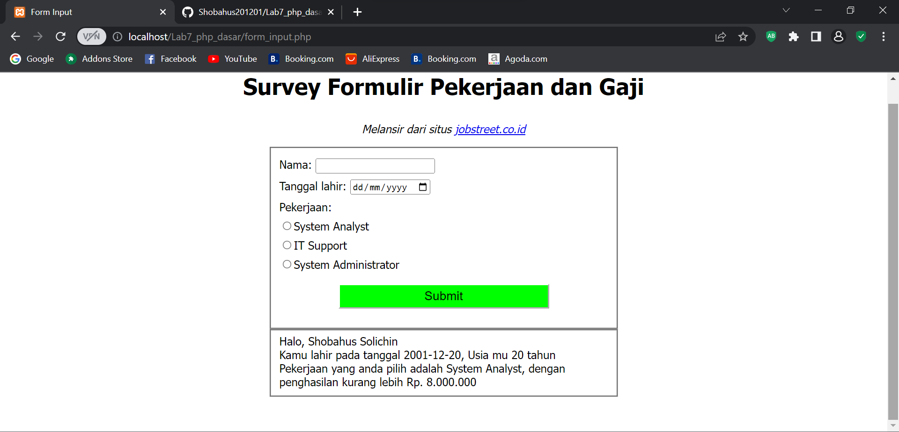
